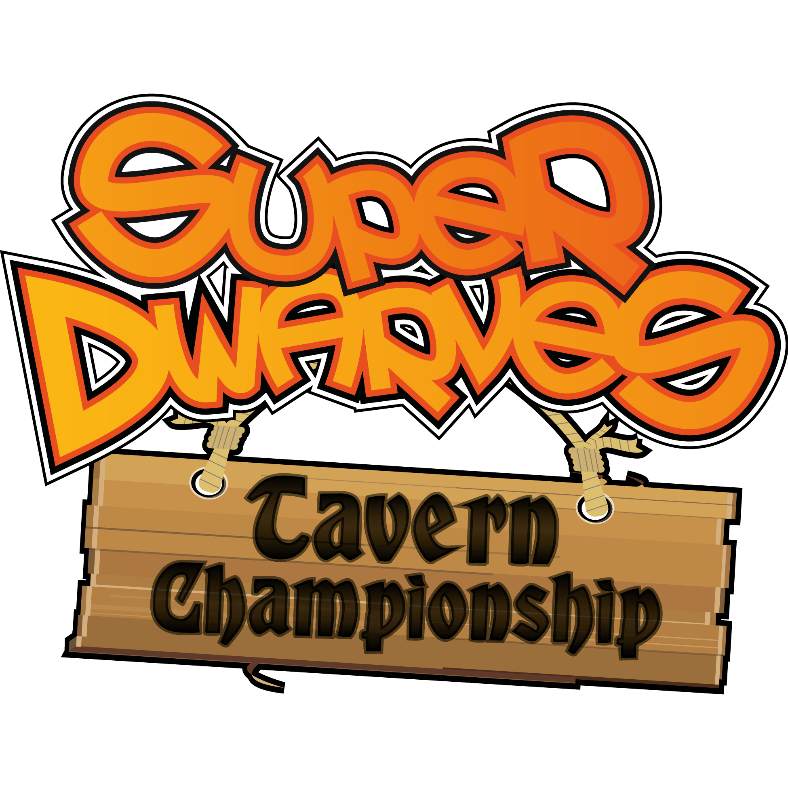
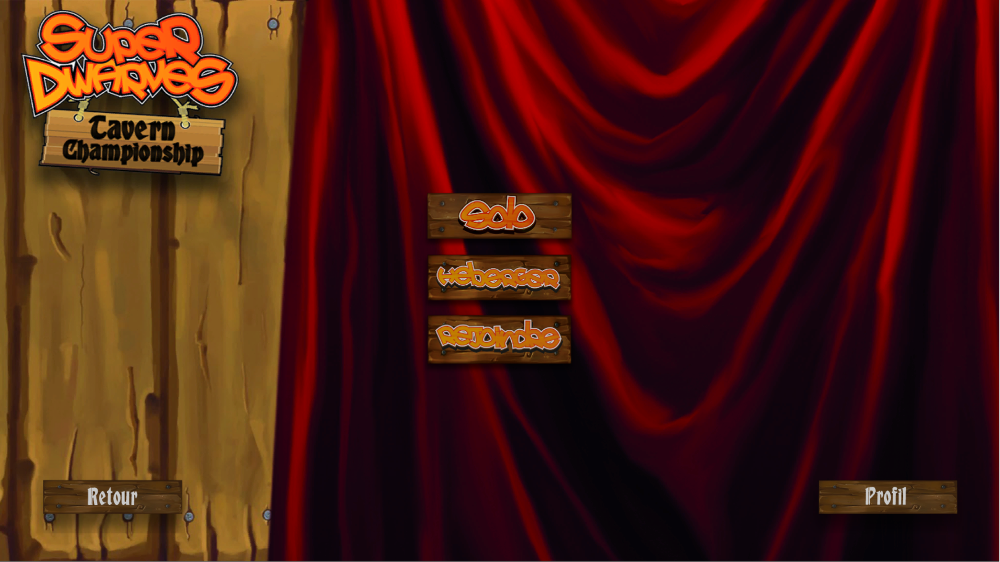
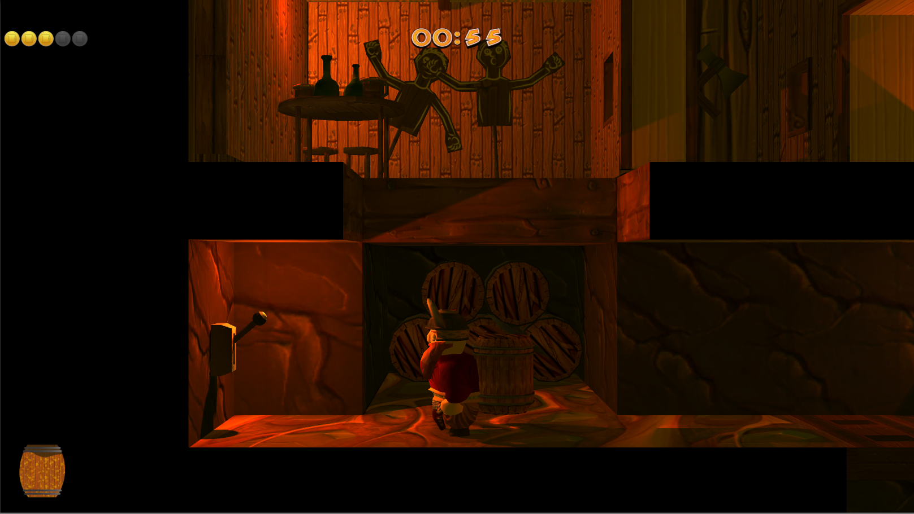
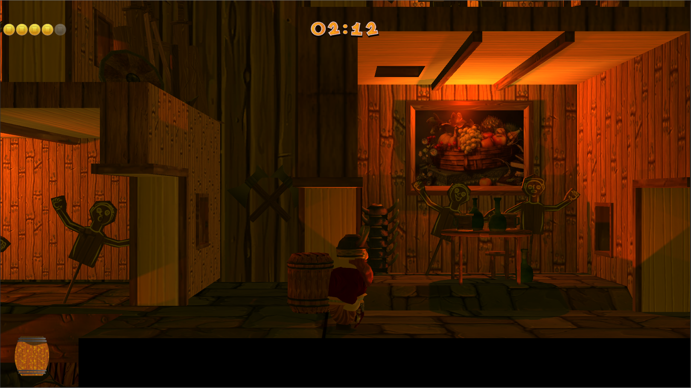
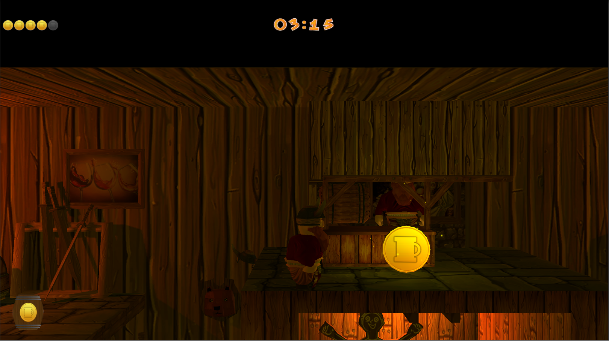
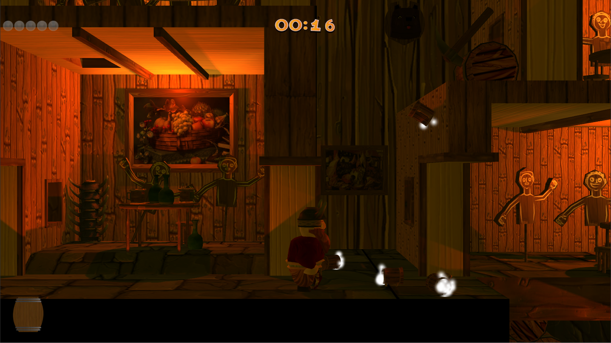

# SuperDwarves Tavern Championship (scripts only)

Most graphical elements were made by Barbedor Eric, who worked on this project with me.  

## The game
You play a dwarf in the great Tavern Championship. This is an annual event, where dwarves compete for the glorious title of the best bartender (of the year).  
You can play alone but this game is better if you play with friends, in multiplayer.

The goal is to pick up a barrel of beer, serve all the beer in your barrel to the different tables, and then get a coin from the arbitrator.  
Be careful, even if dwarves drink a lot, you won't always be able to serve all your beer at once. Tables that recently received beer will still be drinking it.
To slow down other players, you can serve more quickly your beer to thirsty dwarves, but you can also throw pints to them. If you hit an ennemy player with a pint, he will be stunned for a short time.

The first team with five coins wins the game.

- Main menu

- Get a barrel

- Serve your beer

- Get your coin

- Throw pints !

- Repeat !

## Networking
Networking uses the new API of Unity called "UNet", which is based on RPC.  
The host is responsible for the state of the game (such as the number of coins of each teams, traps, tables, ...). Clients are only responsible for their own character, including the stuns that may affect them.
This gives the advantage to the "victim" if there is a network conflict.  
Discovery of the Host in the local network is made by broadcasting the host's local IP address.